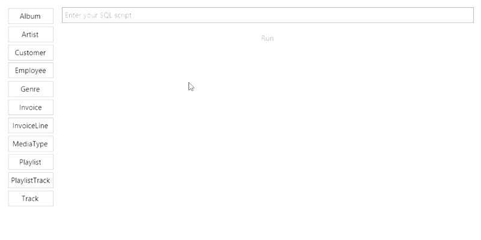

# RunSQL



## About

RunSQL is a simple cross-platform application for testing SQL select queries.

Supported database servers:

- SQLite v3.31.1

## Sample Data

The source data was taken from the [Chinook Database](https://github.com/lerocha/chinook-database) project.

## How build it?

An easy way to build from source code is to use the [Git](https://git-scm.com/downloads) and the [.NET Core SDK 3.1](https://dotnet.microsoft.com/download/dotnet-core/3.1) as follows:

```sh
$ git clone https://github.com/rstm-sf/RunSQL.git && cd RunSQL

$ dotnet build -c Release
$ dotnet src/RunSQL/bin/Release/netcoreapp3.1/RunSQL.dll
```

Also, we can preliminarily change the [target framework](https://docs.microsoft.com/en-us/dotnet/standard/frameworks) in `.csproj` file to another one that [implementation supports](https://docs.microsoft.com/en-us/dotnet/standard/net-standard#net-implementation-support) .NET Standard 2.0.
